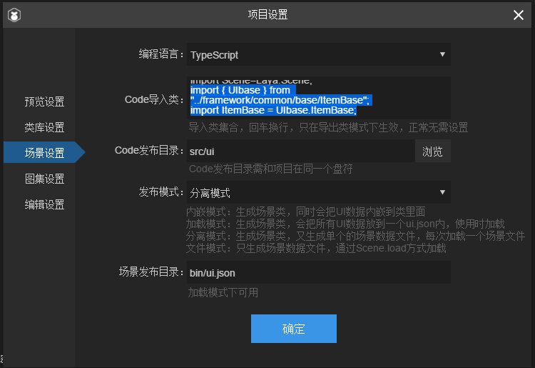
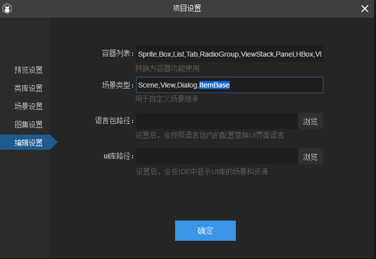
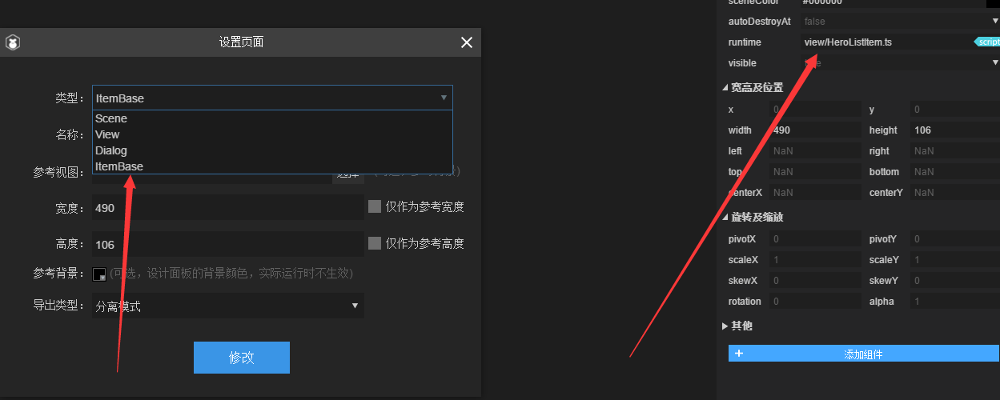

<h1 align="center">Laya自定义View</h1>
Laya version 2.x

# 1.编写自定义view
```
export namespace UIbase {
    //自定义view
    export class ItemBase extends Laya.View{
        //.....
    }
}
```
# 2.IDE设置自定义View导入
快捷键：F9

```
import { UIbase } from "../framework/common/base/ItemBase";
import ItemBase = UIbase.ItemBase;
```



# 3.使用自定义View


```
export default class HeroListItem extends ui.view.HeroListItemUI {
    //....
}
```