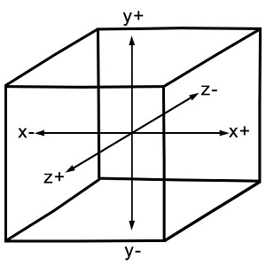

<h1 align="center">WebGL 基础</h1>

[原文链接](https://www.tutorialspoint.com/webgl/webgl_basics.htm)

WebGL主要是一个低级的光栅化API，而不是3D API。要使用WebGL绘制图像，你必须传递一个表示图像的矢量。然后使用OpenGL SL将给定的矢量转换为像素格式，并在屏幕上显示图像。编写WebGL应用程序涉及一系列步骤，我们将在本章中对此进行解释。

<h2 align="center">WebGL-坐标系统</h2>

与其他3D系统一样，WebGL中也有x、y和z轴，其中z轴表示深度。WebGL中的坐标被限制为(1,1,1)和(- 1，- 1，-1，-1)。这意味着-如果你把屏幕投影的WebGL图形看作一个立方体，那么立方体的一个角将是(1,1,1)，另一个角将是(-1，-1，-1)。WebGL不会显示任何超出这些边界的内容。

下图描述了WebGL坐标系统。z轴表示深度。z的正值表示该对象靠近屏幕/查看器，而z的负值表示该对象远离屏幕。同样，x的正值表示该对象位于屏幕的右侧，负值表示该对象位于屏幕的左侧。类似地，y的正负值表明对象是在屏幕的顶部还是底部。



<h2 align="center">WebGL图形</h2>

在获得canvas对象的WebGL上下文之后，您可以开始使用JavaScript中的WebGL API绘制图形元素。

在开始使用WebGL之前，你需要知道一些基本术语。

<h2 align="center">Vertices</h2>

通常，要绘制物体，如多边形，我们在平面上标记点，并将它们连接起来形成所需的多边形。顶点是定义3D对象的边的连接点。它由三个浮点值表示，每个值分别表示x, y, z轴。

<h2 align="center">示例</h2>

在下面的例子中，我们画了一个三角形，顶点为:(0.5,0.5)，(-0.5,0.5)，(-0.5，-0.5)。


**注意:** 我们必须使用JavaScript数组手动存储这些顶点，并使用顶点缓冲区将它们传递给WebGL渲染管道。

<h2 align="center">Indices</h2>

在WebGL中，数值被用来识别顶点。这些数值称为indices。这些索引用于在WebGL中绘制网格。


**注意:** 就像顶点一样，我们使用JavaScript数组存储索引，并使用索引缓冲区将它们传递给WebGL渲染管道。

<h2 align="center">Arrays</h2>

不像OpenGL和JoGL，在WebGL中没有预定义的方法来直接渲染顶点。我们必须使用JavaScript数组手动存储它们。

<h2 align="center">示例</h2>

```
var vertices = [ 0.5, 0.5, 0.1,-0.5, 0.5,-0.5] 
```

<h2 align="center">Buffers</h2>

缓冲区是WebGL中保存数据的内存区域。有各种各样的缓冲区，即绘图缓冲区、帧缓冲区、vetex缓冲区和索引缓冲区。采用顶点缓冲器和索引缓冲器来描述和处理模型的几何形状。

顶点缓冲区对象存储关于顶点的数据，而索引缓冲区对象存储关于索引的数据。在将顶点存储到数组中之后，我们使用这些Buffer对象将它们传递给WegGL图形管道。

**帧缓冲区** 是保存场景数据的图形内存的一部分。该缓冲区包含诸如表面的宽度和高度(以像素为单位)、每个像素的颜色、深度和模具缓冲区等细节。

<h2 align="center">Mesh</h2>

要绘制2D或3D对象，WebGL API提供了两个方法，即drawArrays()和drawElements()。这两个方法接受一个名为mode的参数，您可以使用该参数选择要绘制的对象。此字段提供的选项仅限于点、线和三角形。

要使用这两种方法绘制3D对象，我们必须使用点、线或三角形构造一个或多个基本多边形。然后，使用这些基本的多边形，我们可以形成一个网格。

使用基本多边形绘制的3D对象称为网格。WebGL提供了几种绘制3D图形对象的方法，但用户通常更喜欢绘制网格。

<h2 align="center">示例</h2>

在下面的示例中，您可以看到我们使用两个三角形→{1,2,3}和{4,1,3}绘制了一个正方形。


<h2 align="center">着色器编程</h2>

我们通常使用三角形来构造网格。由于WebGL使用GPU加速计算，这些三角形的信息需要从CPU传输到GPU，这需要大量的通信开销。

WebGL提供了一个解决方案来减少通信开销。由于它使用了运行在GPU上的ES SL(嵌入式系统着色语言)，我们使用着色程序(我们使用OpenGL ES着色语言/ GLSL编写的程序)在客户端系统上绘制图形元素所需的所有程序。

这些着色器是用于GPU的程序，用于编写着色程序的语言是GLSL。在这些着色器中，我们精确地定义顶点、转换、材料、灯光和相机如何相互作用，以创建一个特定的图像。

简而言之，它是一个代码片段，实现了为网格获取像素的算法。我们将在后面的章节中讨论更多关于着色器的内容。有两种类型的着色器-顶点着色器和片段着色器。

<h2 align="center">顶点着色器-Vertex Shader</h2>

顶点着色器是在每个顶点上调用的程序代码。它用于将几何体(例如:三角形)从一个地方变换到另一个地方。它处理每个顶点的数据(每个顶点的数据)，如顶点坐标、法线、颜色和纹理坐标。

在顶点着色的ES GL代码中，程序员必须定义属性来处理数据。这些属性指向一个用JavaScript编写的顶点缓冲对象。

下面的任务可以使用顶点着色器执行−

    顶点变换
    正规变换与标准化
    纹理坐标生成
    材质调变
    光照
    颜色材质应用

<h2 align="center">片段着色器(像素着色器) - Fragment Shader(Pixel Shader)</h2>

网格由多个三角形组成，每个三角形的表面被称为片段。片段着色器是运行在每个片段的所有像素上的代码。它是用来计算和填充单个像素上的颜色的。

以下任务可以使用碎片着色器执行−

    操作插值
    纹理存取
    雾生成
    颜色求和


<h2 align="center">OpenGL ES SL变量</h2>

OpenGL ES SL的完整形式是OpenGL嵌入式系统着色语言。为了处理着色程序中的数据，ES SL提供了三种类型的变量。它们是

    Attributes − 这些变量保存顶点着色程序的输入值。属性指向包含逐顶点数据的顶点缓冲区对象。每次顶点着色器被调用时，属性指向不同顶点的VBO。
    Uniforms − 这些变量保存的输入数据对于顶点和片段着色器来说都是常见的，比如光线位置、纹理坐标和颜色。
    Varyings − 这些变量用于将数据从顶点着色器传递到片段着色器。

有了这些基础知识，我们现在将继续讨论图形管道。

[上一页](./webgl-canvas.md) ====== [下一页](./webgl-GraphicsPipeline.md)