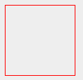
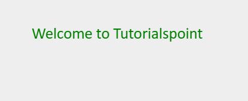
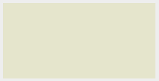

<h1 align="center">WebGL Html5 Canvas 概述</h1>

[原文链接](https://www.tutorialspoint.com/webgl/html5_canvas_overview.htm)

为了在web上创建图形应用程序，HTML-5提供了一组丰富的特性，如2D Canvas、WebGL、SVG、3D CSS转换和SMIL。要编写WebGL应用程序，我们使用HTML-5现有的canvas元素。本章提供了一个HTML-5 2D画布元素的概述。

<h2 align="center">HTML5 Canvas</h2>

HTML-5 \<canvas\>提供了一个简单而强大的选项来使用JavaScript绘制图形。它可以用来绘制图形，制作照片组合，或做简单(复杂)的动画。

这是一个简单的\<canvas\>元素，只有两个特定的属性宽度和高度，加上所有的核心HTML-5属性，如id, name和class。

<h2 align="center">语法</h2>

HTML画布标签的语法如下所示。你必须在双引号(" ")中填写画布的名称。

```
<canvas id = "mycanvas" width = "100" height = "100"></canvas>
```

<h2 align="center">Canvas 属性</h2>

canvas标签有三个属性，即id、width和height。

    Id − Id表示文档对象模型(DOM)中画布元素的标识符。
    Width − 表示画布的宽度。
    Height − 表示画布的高度。

这些属性决定了画布的大小。如果程序员没有在canvas标签下指定它们，那么Firefox、Chrome和Web Kit等浏览器默认情况下提供的canvas元素的大小为300 × 150。

<h2 align="center">示例 - 创建Canvas</h2>

下面的代码展示了如何创建画布。我们已经使用CSS给画布绘制了一个彩色边框。

```
<html>
   <head>
      <style>
         #mycanvas{border:1px solid red;}
      </style>
   </head>
   <body>
      <canvas id = "mycanvas" width = "100" height = "100"></canvas>
   </body>
</html>
```

在执行时，上面的代码将产生以下效果



<h2 align="center">渲染上下文</h2>

\<canvas\>最初是空白的。为了在canvas元素上显示某些内容，我们必须使用脚本语言。该脚本语言应该访问上下文并在其上绘制。

canvas元素有一个名为getContext()的DOM方法，用于获取上下文及其绘制函数。此方法接受一个参数，即上下文类型 2d。

将编写以下代码以获得所需的上下文。您可以在body标记中编写此脚本，如下所示。

```
<!DOCTYPE HTML>
<html>
   <body>
      <canvas id = "mycanvas" width = "600" height = "200"></canvas>
      <script>
         var canvas = document.getElementById('mycanvas');
         var context = canvas.getContext('2d');
			
         context.font = '20pt Calibri';
         context.fillStyle = 'green';
         context.fillText('Welcome to Tutorialspoint', 70, 70);
      </script>
   </body>
</html>
```
在执行时，上面的代码将产生以下效果



更多关于html5 -5 2D Canvas的例子，请查看以下链接html5 -5 Canvas。[跳转](https://www.tutorialspoint.com/html5/html5_canvas.htm)


<h2 align="center">WebGL上下文</h2>

HTML5 Canvas也被用来编写WebGL应用程序。要在canvas元素上创建WebGL渲染上下文，您应该将字符串"experiment-WebGL"而不是"2d"传递给canvas的getcontext()方法。一些浏览器只支持'webgl'。

```
<!DOCTYPE html>
<html>
   <canvas id = 'my_canvas'></canvas>
	
   <script>
      var canvas = document.getElementById('my_canvas');
      var gl = canvas.getContext('experimental-webgl');
      gl.clearColor(0.9,0.9,0.8,1);
      gl.clear(gl.COLOR_BUFFER_BIT);
   </script>
</html>
```
在执行时，上面的代码将产生以下效果



[上一页](./webgl-introduction.md) ====== [下一页](./webgl-basics.md)