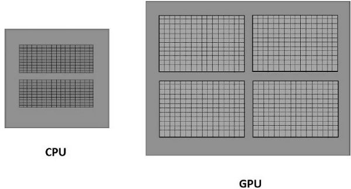
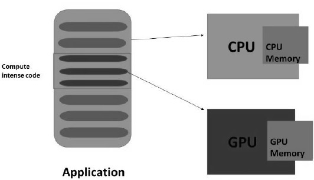

<h1 align="center">WebGL - 介绍</h1>

几年前，Java应用程序——作为applet和JOGL的组合——通过寻址GPU(图形处理单元)在Web上处理3D图形。由于applet需要JVM来运行，因此很难依赖Java applet。几年后，人们不再使用Java小程序。

Adobe (Flash, AIR)的Stage3D api架构提供了GPU硬件加速。利用这些技术，程序员可以在网页浏览器以及IOS和Android平台上开发具有2D和3D功能的应用程序。但由于Flash是一款专有软件，因此它并没有被用作网页标准。

2011年3月，WebGL发布。它是一个可以在没有JVM的情况下运行的开放软件。它完全由网络浏览器控制。

HTML 5的新版本有几个特性来支持3D图形，如2D Canvas、WebGL、SVG、3D CSS转换和SMIL。在本教程中，我们将介绍WebGL的基础知识。

<h1 align="center">什么是OpenGL</h1>

OpenGL(开放图形库)是一个用于2D和3D图形的跨语言、跨平台的API。它是命令的集合。OpenGL4.5是OpenGL的最新版本。下表列出了一组与OpenGL相关的技术。

| API | 技术用于 |
| ---- | ---- |
| OpenGL ES | 它是用于嵌入式系统(包括控制台、电话、设备和车辆)上的2D和3D图形库。OpenGL ES 3.1是其最新版本。由Khronos Group www.khronos.org维护 |
| JOGL | 它是OpenGL的Java绑定。JOGL 4.5是它的最新版本，由jogamp.org维护。 |
| WebGL | 它是OpenGL的JavaScript绑定。WebGL 1.0是它的最新版本，由khronos组维护。 |
| OpenGLSL | OpenGL着色语言。它是一种与OpenGL 2.0及更高版本配套的编程语言。它是核心opengl4.4规范的一部分。它是一种专门为嵌入式系统(如手机和平板电脑)量身定制的API。 |

***注 - 在WebGL中，我们使用GLSL来编写着色器。***

<h1 align="center">什么是WebGL</h1>

WebGL (Web Graphics Library)是Web上3D图形的新标准，它的目的是渲染2D图形和交互式3D图形。它来源于OpenGL的ES 2.0库，这是一个用于手机和其他移动设备的低级3D API。WebGL提供了类似于ES 2.0(嵌入式系统)的功能，并且在现代3D图形硬件上表现良好。

它是一个可以与HTML5一起使用的JavaScript API。WebGL代码是在HTML5的\<canvas\>标签中编写的。它是一个允许互联网浏览器访问图形处理单元(gpu)的规范，并在这些计算机上使用它们。

<h1 align="center">是谁开发的WebGL</h1>

一位名叫Vladimir Vukicevic的美籍塞尔维亚软件工程师做了基础工作，并领导了WebGL的创建

    2007年，Vladimir开始为HTML文档的Canvas元素开发OpenGL原型。
    2011年3月，Kronos Group创建了WebGL。

<h1 align="center">渲染</h1>

渲染是用计算机程序从模型中生成图像的过程。在图形学中，虚拟场景是通过渲染程序来描述的，使用的信息包括几何、视点、纹理、光照和阴影。这个渲染程序的输出将是一个数字图像。

渲染有两种呈现类型

    软件渲染−所有渲染计算都是在CPU的帮助下完成的。
    硬件渲染−所有图形计算都由GPU(图形处理单元)完成。

渲染可以在本地或远程完成。如果要渲染的图像太复杂，那么渲染可以在一个有足够硬件资源的专用服务器上远程完成，以渲染复杂的场景。它也被称为基于服务器的呈现。渲染也可以由CPU在本地完成。它被称为基于客户端的呈现。

WebGL遵循基于客户端的渲染方法来渲染3D场景。获取图像所需的所有处理都使用客户机的图形硬件在本地执行。

<h1 align="center">GPU</h1>

根据NVIDIA的说法，GPU是“一个集成了变换、照明、三角形设置/裁剪和渲染引擎的单芯片处理器，每秒能够处理至少1000万个多边形。”不同于为顺序处理而优化了几个核的多核处理器，GPU由数千个更小的核组成，高效地并行处理工作负载。因此，GPU加速了帧缓存(ram中包含完整帧数据的一部分)中用于输出到显示器的图像的创建。

<h1 align="center">GPU加速计算</h1>

在GPU加速计算中，应用程序被加载到CPU中。每当它遇到计算密集型的部分代码，那么这部分代码将被加载到GPU上运行。它使系统能够以一种有效的方式处理图形。

GPU将有一个单独的内存，它在同一时间运行一小部分代码的多个副本。GPU处理所有在本地内存中的数据，而不是与CPU共享内存。因此，需要将GPU需要处理的数据加载/复制到GPU内存中，再进行处理。

在具有上述架构的系统中，为了实现更快的3D程序处理，需要减少CPU和GPU之间的通信开销。为此，我们必须将所有数据复制并保存在GPU上，而不是重复与GPU通信。

<h1 align="center">浏览器支持</h1>

下表显示了支持WebGL的浏览器列表

| 浏览器名 | 版本 | 支持 |
| ---- | ---- | ---- |
| Internet Explorer | 11或更高 | 完全支持 |
| Google Chrome | 39或更高 | 完全支持 |
| Safari | 8 | 完全支持 |
| Firefox | 36或更高 | 部分支持 |
| Opera | 27或更高 | 部分支持 |

移动浏览器

| 浏览器名 | 版本 | 支持 |
| ---- | ---- | ---- |
| Chrome for Android | 42 | 部分支持 |
| Android browser | 40 | 部分支持 |
| IOS Safari | 8.3 | 完全支持 |
| Opera Mini | 8 | 不支持 |
| Blackberry Browser | 10 | 完全支持 |
| IE mobile | 10 | 部分支持 |

<h1 align="center">WebGL的优点</h1>

以下是使用WebGL的优点

    JavaScript编程 - WebGL应用程序是用JavaScript编写的。使用这些应用程序，您可以直接与HTML Document的其他元素交互。你也可以使用其他的JavaScript库(例如JQuery)和HTML技术来丰富WebGL应用。
    增加对移动浏览器的支持 - WebGL还支持移动浏览器，如iOS safari, Android浏览器和Chrome for Android。
    开放源码 - WebGL是一个开源软件。您可以访问库的源代码，了解它是如何工作的，以及它是如何开发的。
    不需要编译 - JavaScript是一个半编程半html的组件。要执行此脚本，不需要编译该文件。相反，您可以使用任何浏览器直接打开文件并检查结果。由于WebGL应用程序是使用JavaScript开发的，因此也不需要编译WebGL应用程序。
    自动内存管理 - JavaScript支持自动内存管理。不需要手动分配内存。WebGL继承了JavaScript的这个特性。
    易于设置和安装 - 因为WebGL集成在HTML5中，所以不需要额外的设置。要编写WebGL应用程序，你只需要一个文本编辑器和一个网络浏览器。

<h1 align="center">环境设置</h1>

没有必要为WebGL设置不同的环境。支持WebGL的浏览器有自己的WebGL内置设置。

[下一页](./webgl-canvas.md)